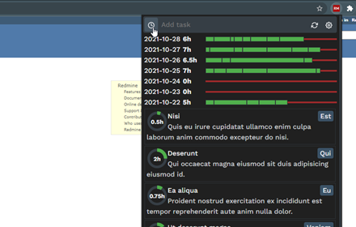
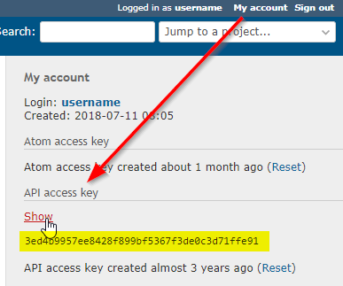

redmine-time-spender
====================

Chrome web store: [Redmine Time Spender](https://chrome.google.com/webstore/detail/ajgdpnedcfflmknmalhcaenanifgfiop)

Spend less time with Redmine time tracking.
* no need to login again because your session has expired
* check your time entries with a simple click/hotkey
* change or create a copy of a time entry with the speed of light

The plugin is still **under development** but it can already be used!

The API key
-----------

1. Log into Redmine.
1. Click on **My account** after login.
2. Under **API access key** click on **Show**.
3. Copy the *key* (40 hexadecimal characters).

Security
--------

Redmine projects/issues/activities and time entries are cached in local IndexedDB.
Except the `id`s and some date properties (`updated_on`, `closed_on`, etc.) everything else is stored encrypted.
The key is saved in a cookie under the configured Redmine URL.
Basically it is as secure as any other cookie in the browser.

Roadmap
-------
* create options page with help (+screenshots)
* fix sync issue- #2
* publish 1.0 🍰

Future plans
------------
* filter issues based on selected project (Laci)
* quick search in tasks and time entries
* favorite projects/issues/activities
* periodic auto-refresh in the background